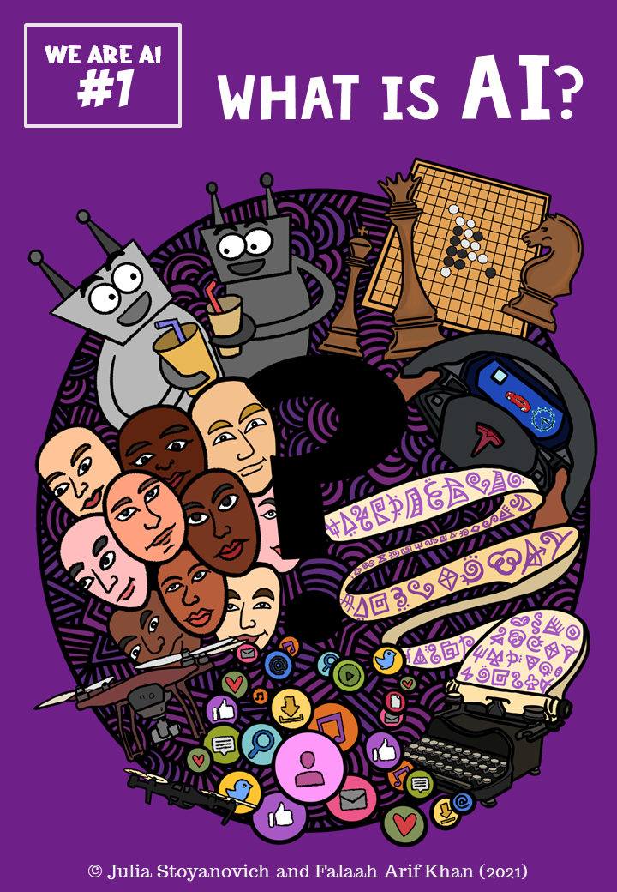
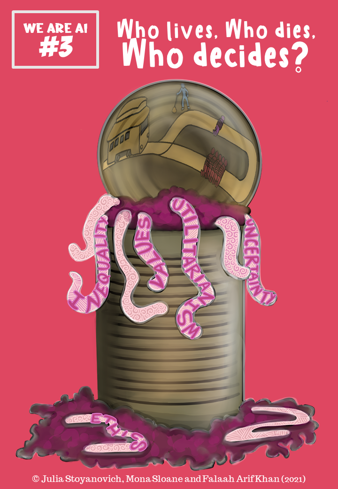

### The _We are AI_ Comic Series

 
##### Volume 1: What is AI?
<!-- 
<a href="../modules/what-is-ai/index/">View comic</a> -->

 <a href="http://bit.ly/we-are-aicomicsvol1">Download comic (PDF, 8.3MB)</a>

 
##### Volume 2: Learning From Data
<!-- 
<a href="../modules/learning-from-data/index/">View comic</a> -->

 <a href="http://bit.ly/we-are-ai_comics_vol2_en">Download comic (PDF, 12.4MB)</a>

 
##### Volume 3: Who lives, Who dies, Who decides?
<!-- 
<a href="../modules/who-lives-who-dies-who-decides/index/">View comic</a> -->

 <a href="http://bit.ly/we-are-ai_comics_vol3_en">Download comic (PDF, 7.8MB)</a> 

 
##### Volume 4: All about that Bias

<i>Coming soon!</i>

<!-- 
<a href="../modules/all-about-that-bias/index/">View comic</a>
 <a href="http://bit.ly/we-are-ai_comics_vol4_en">Download comic (PDF, 0.0MB)</a>
 -->

 
##### Volume 5: We Are AI

<i>Coming soon!</i>

<!-- 
<a href="../modules/we-are-ai/index/">View comic</a>
 <a href="http://bit.ly/we-are-ai_comics_vol5_en">Download comic (PDF, 0.0MB)</a>
 -->
