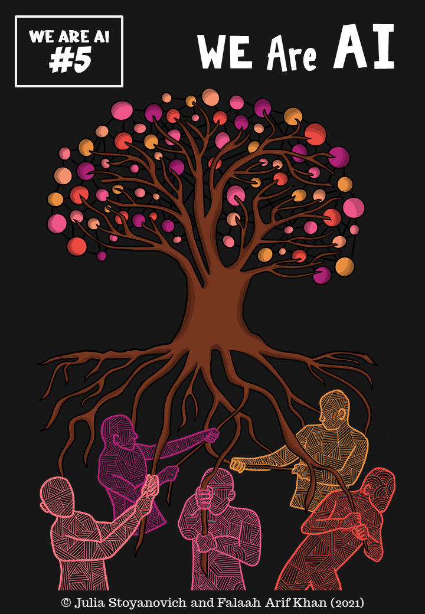

### List of Companion Comics

 
##### Volume 1: What is AI?
<!-- 
<a href="../modules/what-is-ai/index/">View comic</a> -->

 <a href="./vol1_en.pdf">Download comic (PDF, 8.34MB)</a>

 
##### Volume 2: Learning From Data
<!-- 
<a href="../modules/learning-from-data/index/">View comic</a> -->

 <a href="./vol2_en.pdf">Download comic (PDF, 12.4MB)</a>

 
##### Volume 3: Who lives, Who dies, Who decides?

<i>Coming soon!</i>

<!-- 
<a href="../modules/who-lives-who-dies-who-decides/index/">View comic</a>
 <a href="./vol3_en.pdf">Download comic (PDF, 0.0MB)</a>
 -->

 
##### Volume 4: All about that Bias

<i>Coming soon!</i>

<!-- 
<a href="../modules/all-about-that-bias/index/">View comic</a>
 <a href="./vol4_en.pdf">Download comic (PDF, 0.0MB)</a>
 -->

 
##### Volume 5: We Are AI

<i>Coming soon!</i>

<!-- 
<a href="../modules/we-are-ai/index/">View comic</a>
 <a href="./vol5_en.pdf">Download comic (PDF, 0.0MB)</a>
 -->
