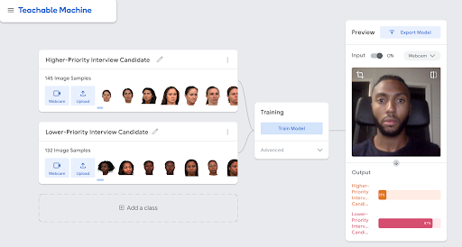

## Dirty Data, Bad Predictions
_Suggested time: 30 min_

As we already saw, a common task for machine learning algorithms is classifying: classifying credit card transactions as “fraud” or “not fraud”, or classifying job applicants as “promising” or “not promising.” To perform these tasks, machines need to be trained on data. In this activity, you will interact with a machine learning application to screen job applicants at a fictional retail company called Stock-Mart and analyze the data used to train the application. 

The retail giant Stock-Mart has developed a machine learning algorithm to help screen applicants for hiring. Stock-Mart has trained this algorithm using data (photos) from previously “successful” employees. Success in this context was defined as: (1) never missed a day of work, (2) worked at the company for at least four years, and (3) was promoted at least once. 

Using photos of employees that met and did not meet this criteria, the algorithm learned what successful and unsuccessful employees looked like. Based on this training data, the system predicts which job applicants should be high or low priority candidates to interview by scanning their faces. Stock-Mart is excited as they think that this tool will help the human resource department save time by screening applicants. But is it fair? 

 

#### Explore Stock-Mart’s Screening Tool (15 mins)

<i>above: Course co-creator Eric, a Black man wearing a dark shirt and sitting in a black office chair, interacts with the Stock-Mart screening algorithm. Underneath his face shows two outputs ranking his priority level: 13% for Higher-Priority and 87% for Lower-Priority.</i>

 

1. [Review the data](https://drive.google.com/drive/folders/1G082cys1xSJEnhxnxrv70-dkwhLry63A) that Stock-Mart used to train their algorithm to screen job candidates as high priority or low priority candidates. Recall that photos of employees in the higher-priority folder meet the success criteria (never missed a day of work, worked at the company for at least four years, was promoted at least once) while the employees in the lower-priority folder did not. 
* How are the images similar?
* How are the images different? 

2. Visit [Stock-Mart’s screening algorithm](https://teachablemachine.withgoogle.com/models/jyGBSu_n1/)
* Make sure your web browser has access to a webcam
* Try the application in normal lighting conditions (not too bright, not too dark)
* Remain as still as possible and try to position yourself so the camera captures the neck-up with as few background objects as possible

3. Note how the program classifies you. Are you able to alter your classification by moving around, adjusting the light, or changing anything else about your appearance? Can you identify any patterns that influence your results?  
* Gender?
* Age?
* Race?

 

#### Group Discussion (15 min)

Let’s say that Stock-Mart’s applicant data was collected over a 10 year period, and that during that same time period Stock-Mart was found guilty of workplace discrimination against minorities by a federal court. 

* How might a system built on historical data amplify social inequalities?
* In addition to “never missed a day of work, worked at the company for at least four years, was promoted at least once”, what other criteria for prioritizing candidates might exist?
