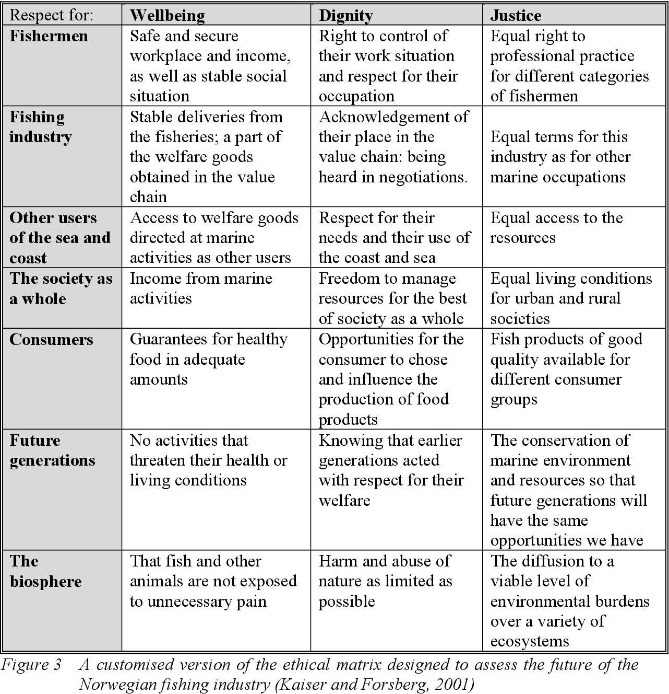

## Module #3 - Who Lives, Who Dies, Who Decides? 

 

Module #3 draws from Competency #16: 

* **Identify and describe different perspectives on the key ethical issues surrounding AI.**

The paper presents this competency as a list of ethical issues areas: 

1. **Privacy/surveillance:** The amount of personal data that is collected, stored, and analyzed in order for many AI systems to function has raised concerns about user privacy [119], government surveillance [56], and data security [35].
1. **Employment:** Advances in automation have reduced the need for human workers while also increasing productivity, an issue that has generated concern long before AI [11]. However, advancements in AI have heightened concerns about technology replacing the human workforce [75,144].
1. **Misinformation:** The spread of misinformation and “fake news” has been exacerbated by AI algorithms on social media and search engines that promote “clickbait” articles and create “filter bubbles” [104].
1. **Singularity/concern about harm to people:** The idea of “the singularity”—or the time when machine intelligence surpasses human intelligence [85]—has been popularized in science fiction, and many have concerns about AI intentionally causing harm to people [13,144].
1. **Ethical decision making:** Most computing ethics syllabi and textbooks emphasize that embedding ethical decision- making strategies in technical systems is a challenging problem [8,108]. Giving decision-making power to AI can result in ethical dilemmas such as the trolley problem [129] or unexpected results due to AI executing actions that people tell it to do rather than doing what people intend it to do (e.g. a self-driving car driving at 125 mph because it was told to get to the airport “as fast as possible”) [35].
1. **Diversity:** Diversity in the CS workforce is an issue, and gender diversity in AI is no exception—in 2018, 80% of AI professors and 71% of applicants to AI-related jobs identified as male [122]. Lack of workforce diversity can affect who systems are developed for [33]—a significant issue in AI, where biased algorithms can have pronounced adverse effects on marginalized subgroups [32].
1. **Bias/fairness:** Most of the papers in the 2018 FAT ML conference focused on issues related to algorithmic bias (e.g. [118,121]). Algorithmic bias is often directly related to bias present in training datasets. Agents in-the-wild are also able to learn bias and bigotry from human users [99].
1. **Transparency:** Many AI algorithms (especially in ML) are black-box and their functionality (and sometimes even existence) can be opaque to users [55]. This can lead to deception and misunderstanding. [55]. The ACM recently defined seven principles relating to algorithmic transparency and accountability as part of its code of ethics, suggesting that additional tactics are needed to address issues of transparency (e.g. developing explainable AI, testing and documenting models, and promoting bias awareness) [3].
1. **Accountability:** A major issue with AI being used to make life-altering decisions in areas such as hiring or recidivism is that there is often no way to report algorithmic errors [134], receive feedback on why decisions were made [51], or hold anyone accountable for errors that adversely affect people’s lives. The EU’s recent GDPR legislation mandates that “data subjects” have the right to challenge decisions made by AI and receive an explanation, but this remains challenging in practice [52]. 

Clearly, there is no way to engage all nine of these (this could be an entire learning circle unto itself). In light of this, we decided to focus on **Ethical decision-making** as this is the most generalizable of the 9 and is most relevant to the overall goal of this learning circle. In particular, we wanted to emphasize the importance of considering different stakeholders in ethical decision-making.

The paper provides the following strategies for this competency: 

AI ethics education initiatives use a variety of interdisciplinary strategies to communicate key ethical concepts, including creating “ethical matrices” to consider values of different stakeholders in technology, imagining future AI and its implications, reflecting on AI representations in popular media and the news, discussing and debating key ethical questions, and engaging in programming activities that spur learners to critically examine algorithms and bias [6,69,93,145]. In informal spaces, artists and researchers have created interactive art experiences that spur participants to question the implications of technologies like facial recognition [34,70].

Our current implementation aligns with several of these strategies. The module grounds the conversation of ethical decision-making with a [short video on the Trolley problem](https://dataresponsibly.github.io/we-are-ai/modules/who-lives-who-dies-who-decides/the-trolley-problem/). Here, we use the trolley problem as a “can opener” to a broader conversation about ethical decision-making with AI. The [following video](https://dataresponsibly.github.io/we-are-ai/modules/who-lives-who-dies-who-decides/the-problem/) deepens this conversation by pointing out the limitations of the trolley problem when applied to high-stakes uncertainty presented by emergent algorithmic technologies. In particular, the video ends by noting the importance of considering a diverse array of stakeholders and differential impacts of decisions due to histories of inequality in society. This is a key takeaway and recurring point of emphasis in the course. 

A [group activity](https://dataresponsibly.github.io/we-are-ai/modules/who-lives-who-dies-who-decides/the-ethics-matrix/) picks up where the video leaves off by inviting learners to complete an ethical matrix based on a real world scenario involving a self-driving car. The purpose of the ethical matrix is to help consider each stakeholder in relation to pertinent values with the assumption being that values might be held in common but interpreted differently. Below is an example of a matrix in the context of the fishing industry:

Use of the ethical matrix may be expected to result in one or more of the following outcomes: 
* raise awareness of a wide range of ethical issues
* encourage ethical reflection
* provide a common basis for ethical decision-making
* identify areas of agreement between individuals who might nevertheless differ in their overall judgements
* clarify the basis of disagreements
* make explicit the reasoning that underpins any ethical decisions

The group activity uses an ethical matrix in the context of a real-world scenario in which a woman was killed by a self-driving car operated by Uber. The activity recreates the key points from the video: it is a high-stakes, uncertain situation with multiple stakeholders. In this way, the scenario, a narrative passage from a book, invites learners to navigate the mess of ethical decision-making that is obscured in the neatness of the trolley problem. In all, the activity should provide learners a formalized structure for grounding various ethical conversations on algorithms moving forward as many algorithm decisions can be modeled from this setup. 

The post-activity discussion highlights a few key takeaways through the questions asked to learners: 
1. What stakeholders are missing? Is it ok for us to speak on behalf of these missing voices? 
1. How would you approach conversations with technologists and decision-makers to convince them to improve the design and use of the tool? 

#1 should get learners to reflect on the positions they took on to speak on behalf of stakeholders (cyclists, transportation boards, etc.) that they may not understand nor reflect personally. This is intentionally ironic to model the shortcomings of speaking on others’ behalf. #2 works towards the larger goal of engendering agency by prompting learners to think about how and who they would have these kinds of ethical debates with moving forward beyond this learning circle. 
