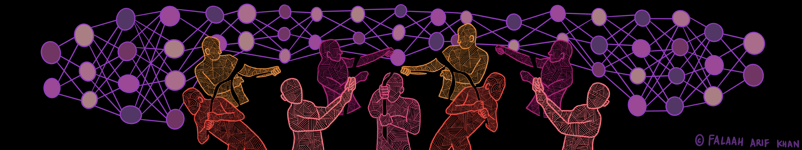

## Check-In
_Suggested time: 10 min_

### Introduction/Recap 
In the previous modules of this course, we have explored the basics of AI, from how it works to the ethical dilemmas of its use in modern life. In offering insights into the benefits and the harms that AI can bring to our daily lives, we have likely raised more questions than we have answered. Today we will reflect about what we can do—as a learning circle and as individuals—to help critically shape the use of AI systems in the future.

 

### Warm Up: Reflective Discussion
Based on your experience in this learning circle thus far, take a few minutes to write a reflection (bullet points are fine) about an action involving AI in your personal life or work that you might take moving forward. Be as broad or as specific as you like: What is the action? What will it accomplish?

Once everyone has completed writing, take turns sharing the actions each person is interested in exploring.
