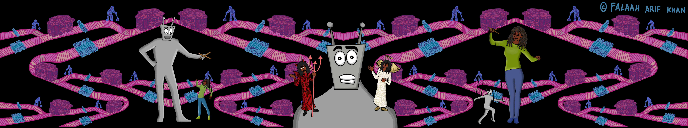

## Check-In and Review
_Suggested time: 5 min_

 

#### Welcome back!

Take a few minutes to share feedback on the previous sessions. Open the floor to any suggestions from the group about additional expectations they'd like to propose going forward.

 

#### Module 2 Review 

In Module 2, we discussed how machines learn from data to make decisions on our behalf, and how some of those decisions can have a great impact on our lives. 

We learned about **classifiers**, algorithms that make **predictions** about the world based on past experience encoded in the data. Very often, predictions made by classifiers are then turned into **actions**, and so they affect the world. We discussed smart light classifiers, and then designed fraud detection **classifiers**. We also discussed how we might check whether our classifiers work, who benefits when they work, and who is harmed when they make mistakes. 

This conversation about the performance criteria we embed into algorithms, and about how we balance the benefits and the harms to different stakeholders, leads directly into today’s module, where we engage with ethics in AI. We will start by exploring a hypothetical scenario of a fully autonomous self-driving car deciding who lives or dies in a moral experiment called the “Trolley Problem.” We will use this experiment to frame our discussion around the key ethical issues surrounding AI, illustrating why we need to engage in active debate around AI and ethics.

 

#### **Group Check-In**
Give everyone 1–2 minutes to say hello:
* Did you notice any of the themes from last week’s meeting pop up in your life this week? 
* What comes to mind when you think about the term “AI ethics”?
